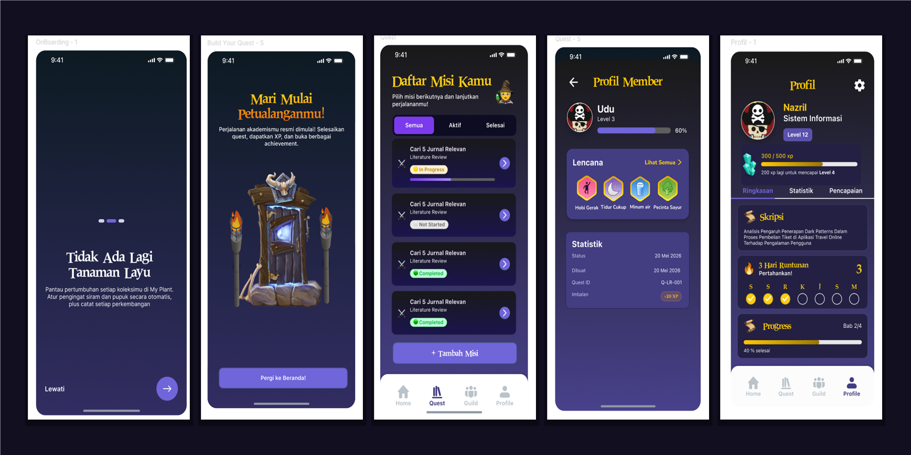

<div align="center">

  

  <p align="center">
    
  </p>

  # ScripsQuest

  **A gamified thesis companion mobile application that transforms the overwhelming journey of writing an academic thesis into an engaging RPG quest.**

  <br />

  
  
  
  

</div>

---

## Table of contents

- [Project overview](#project-overview)
- [Key features](#key-features)
- [Technology stack](#technology-stack)
- [Project structure](#project-structure)
- [Getting Started](#getting-started)
- [Team](#team)

## Project overview

| Item | Details |
| --- | --- |
| Application Type | Mobile Application |
| Primary Platform | Android |

ScripsQuest addresses the widespread academic procrastination and psychological fatigue experienced by undergraduate university students during their final thesis (*skripsi*). By deconstructing a multi-month thesis milestone into bite-sized RPG quests, dynamic XP levels, daily streak trackers, collaborative study guilds, and collectible achievement badges, ScripsQuest transforms thesis writing from a stressful isolated obligation into an engaging, structured, and reward-driven social journey.

## Key features

| Feature | What the user can do |
| --- | --- |
| **Guided Quest Breakdown** | Follow a personalized 14-step thesis curriculum spanning from topic selection, literature review, methodology, data collection, to final defense simulation. |
| **Interactive Quest Management (CRUD)** | Create, customize, edit, and toggle progress for custom thesis tasks and checkpoint milestones with automatic XP rewards. |
| **Lecturer Revision Tracker** | Log and track specific thesis revision feedback and notes given by supervisors (*dosen pembimbing*) until resolved. |
| **Gamified Level & XP Progression** | Earn XP through task completion, level up character status, and calculate required experience points dynamically toward the next rank. |
| **Active Streak Multiplier** | Maintain daily momentum with an animated flame streak counter and weekly progress calendar (S S R K J S M). |
| **Guild Collaboration & Leaderboard** | Create or join thesis guilds via unique invite codes (`S-XXXXXX`), collaborate with peers, and compete on podium leaderboards. |
| **Profile & Badge Showcase** | View thesis topic summaries, statistics counters, and unlock 9 unique medieval RPG achievement badges. |
| **Secure Authentication & Recovery** | Register, sign in, maintain session persistence, and securely reset passwords via Supabase Auth. |

## Technology stack

| Category | Technology | Purpose |
| --- | --- | --- |
| Frontend | Flutter (Dart 3.x) | High-performance cross-platform reactive mobile UI |
| Architecture | Strict MVVM Pattern | Clear separation of UI (Views), State (ViewModels), Domain (Logic), and Data (Repositories) |
| State Management | Provider & MultiProvider | Robust, decoupled state orchestration and dependency injection |
| Backend & Database | Supabase (PostgreSQL) | Managed cloud database with relational tables, foreign key constraints, and indices |
| Authentication | Supabase Auth | Secure email/password authentication, session management, and password recovery |
| Routing & Navigation | GoRouter | Declarative routing system with route constants and unauthenticated auth guard redirects |
| Aesthetics & Assets | Google Fonts & Iconify | Medieval fantasy theme utilizing Cinzel & Inter typography alongside vector iconography |
| Animation | Flutter Animate | Smooth micro-interactions, pulsing streak flame effects, and frame-by-frame splash animations |

## Project structure

```text
├── android/                  # Native Android configuration & launcher icon assets
├── assets/
│   ├── animasi/              # Animated splash sequence frames
│   ├── fonts/                # Inter typography font assets
│   └── images/               # RPG emblems, scrolls, badges, and crystals
├── docs/
│   └── images/               # Repository documentation logo & mockups
├── lib/
│   ├── app.dart              # Root application widget (ScripsQuestApp)
│   ├── main.dart             # Application entry point & Supabase initialization
│   ├── core/
│   │   ├── constants/        # Centralized AppConstants, AppRoutes, and AppAssets
│   │   ├── di/               # MultiProvider dependency injection container
│   │   ├── errors/           # Unified exception handling wrappers
│   │   ├── routes/           # Declarative GoRouter routing definition with Auth Guard
│   │   ├── theme/            # RPG dark theme palette, typography, and styles
│   │   └── utils/            # String formatters and regex form input validators
│   ├── data/
│   │   ├── models/           # Data models (Quest, Profile, Guild, Journey, Badge)
│   │   ├── repositories/     # Data repositories interfacing between services and viewmodels
│   │   └── services/         # Supabase client, database, auth, and storage services
│   ├── logic/                # Pure business & gamification logic (XP, Level, Streak, Curriculum)
│   └── ui/
│       ├── auth/             # Login, registration, and forgot password screens
│       ├── guild/            # Guild dashboard, creation, joining, and member profiles
│       ├── home/             # Main dashboard with streak calendar and daily quests
│       ├── onboarding/       # Onboarding carousel & multi-step quest builder
│       ├── profile/          # Profile view (Ringkasan, Statistik, and Pencapaian tabs)
│       ├── quest_management/ # Quest list, detail views, and edit/create modal
│       ├── splash/           # Animated splash screen
│       └── widgets/          # Reusable UI widgets (Buttons, TextFields, NavBars, Cards)
├── test/                     # Unit test suites (18/18 logic and widget tests)
└── pubspec.yaml              # Flutter project configuration and package dependencies
```

## Getting Started

To get a local copy up and running, follow these simple steps.

### Prerequisites

*   Flutter SDK (v3.12.0 or higher) installed on your machine.
*   Android SDK & Emulator or a physical Android device.
*   An editor like VS Code or Android Studio with Flutter extensions.

### Installation

1.  **Clone the repo**
    ```sh
    git clone https://github.com/zuhdiarif/Raion_hackajm.git
    ```
2.  **Navigate to the project directory**
    ```sh
    cd Raion_hackajm
    ```
3.  **Install dependencies**
    ```sh
    flutter pub get
    ```
4.  **Run the application**
    ```sh
    flutter run
    ```

---

## Team

| Name | Role | Responsibilities | Contact |
| --- | --- | --- | --- |
| **Zuhdi Arif** | Mobile Engineer & Lead Developer | Flutter application development, state management, Supabase backend integration, and logic layer implementation | [GitHub](https://github.com/zuhdiarif) |
| **UI/UX Team** | UI/UX Designer | RPG fantasy game interface design, interactive prototyping, and visual asset generation | [Figma](https://figma.com) |
| **Product Team** | Product Manager | User journey mapping, academic thesis curriculum design, and gamification milestone strategy | [Raion Community](https://raion.ub.ac.id) |
